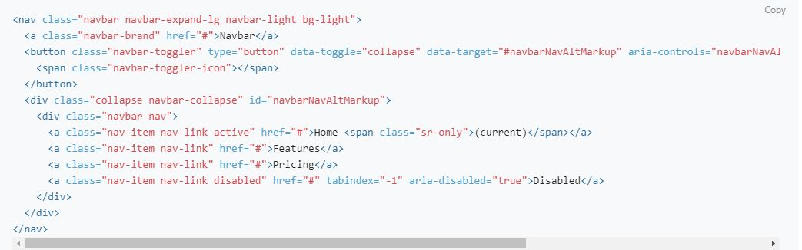
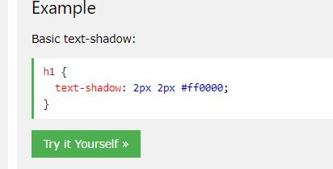
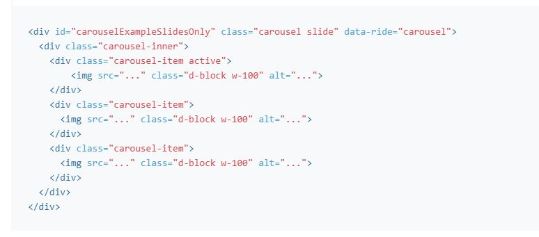
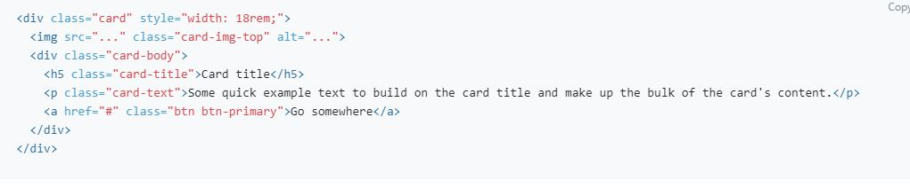
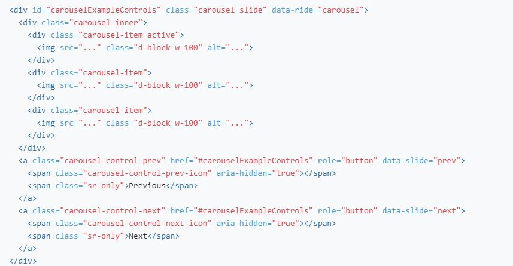
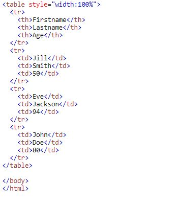
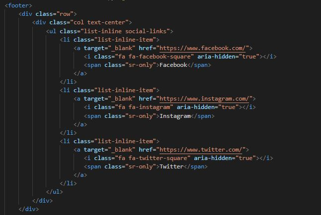
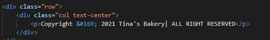

# Tina's Bakery
 They offer service for small and large orders for any event. They even have gluten and lactose free for intolerant. 

 After speaking with my mentor about my ideas, he suggests that I can use [Nuts about cake](http://www.nutsaboutcakes.com) for source of inspiration. 
  
## Overview

### What is this website for?

As a first time visitor this webiste help customers to be able to make cakes and pastries orders online, on the phone or by sending an e-mail. 
As a regular visitor, customers will be able to purchase an order or may be find new information about new products.

### What does it do?

This webiste provides various pages for customers to read lots of information about cakes and pastries. The navigation menu is a great tool to navigate easily through the website.
The website shows different kinds of products to choose. As customers, they can fill  the order form by ordering their own special requirements of what they want with require delivery date. 
There is a possibility to upload file or picture for special order. The customers are also very welcome to visit the shop for coffee, breakfast or lunch. 

### How does it work?
By creating the website, *bootsrap 4* and *Javascript* has been used and some simple *HTML code*. *CSS* to style the website.

---
___

## Features

### The head, title, logo navbar, links, header

* Head: navbar menu
    * Title: Tina's Bakery (The name Tina's bakery is a name that I made up by myself.)
    * logo: 

   * [Free logo design](http://www.freelogodesign.org) used to create the logo

    

   * [links to logo](https://editor.freelogodesign.org/?lang=en&logo=3613cf6a-7633-4fee-8871-8837207f6954)
---

   * The code for navbar was taken from bootsrap. I added more nav-items on the link and changed the description.

   * I used *linear gardient* as the background color for the navbar.
    
I found the code on [w3 schools](http://w3schools.com) 
ink to the source code (https://www.w3schools.com/cssref/func_linear-gradient.asp)

The color I choose for the background is : 

`.menu-bar {
background-image: linear-gradient(purple, pink, white);}`

---
   * The menu contains 7 pages: 
     * Home
     * Cakes
     * Bread
     * Gallery
     * Menu
     * About
     *  Contact

####    Home

*   The header `<h3>Beautiful deluxe baked goods</h3>` was styled with \* text-shadow\* 

    `text-shadow: 1px 1px 2px black, 0 0 25px blue, 0 0 5px darkblue;`
    source from [w3 schools](https://www.w3schools.com/cssref/css3_pr_text-shadow.asp)

    
*    The source code for _image carousel slide only_ was taken from boostrap.

 The image was taken from [canva](http://www.canva.com)

[link to the image](https://www.canva.com/design/DAEVTbZ9BeI/zhHGLaLkkw5lKy2EeM2XTw/edit)

The code source used for all the images on **Menu, cakes, and bread** from bootsrap is below: 

All the images from the **Home** menu was taken from [Besthq wallpapers](http://besthqwallpapers.com)

[birthday deluxe](https://besthqwallpapers.com/sv/semester/grattis-p%C3%A5-f%C3%B6delsedagen-bl%C3%A5-t%C3%A5rta-pojken-f%C3%B6delsedag-grattis-t%C3%A5rta-80176)

[cheese cake deluxe](https://besthqwallpapers.com/sv/mat/choklad-kaka-b%C3%A4r-choklad-bl%C3%A5b%C3%A4r-choklad-cheesecake-49979)

[fruit deluxe](https://besthqwallpapers.com/sv/mat/grattis-p%C3%A5-f%C3%B6delsedagen-t%C3%A5rta-s%C3%B6tsaker-bakverk-frukt-t%C3%A5rta-30157)

[wedding deluxe](https://besthqwallpapers.com/sv/mat/br%C3%B6llopst%C3%A5rta-vit-kr%C3%A4m-vit-multi-niv%C3%A5-t%C3%A5rta-med-rosor-efterr%C3%A4tt-kakor-59142)
    

####    Cakes
   
* All the images from the **Cakes** menu belongs to [Besthq wallpapers](http://besthqwallpapers.com)

    [wedding cake deluxe nr1](https://besthqwallpapers.com/sv/mat/br%C3%B6llopst%C3%A5rta-tr%C3%A4kakastativ-tv%C3%A5delad-t%C3%A5rta-br%C3%B6llop-t%C3%A5rta-153045)

    [wedding cake deluxe nr2](https://besthqwallpapers.com/sv/mat/br%C3%B6llopst%C3%A5rta-r%C3%B6da-rosor-en-stor-kaka-godis-br%C3%B6llop-koncept-40436)

    [wedding cake deluxe nr3](https://besthqwallpapers.com/sv/semester/br%C3%B6llopst%C3%A5rta-br%C3%B6llop-en-stor-kaka-vit-t%C3%A5rta-9174)

    [wedding cake deluxe nr4](https://besthqwallpapers.com/sv/mat/br%C3%B6llopst%C3%A5rta-bakverk-t%C3%A5rta-med-rosor-mat-dekorationer-kakor-47489 )

    [birthday cake deluxe nr 1](https://besthqwallpapers.com/sv/download/35563/800x600)

    [birthday cake deluxe nr 2](https://besthqwallpapers.com/sv/semester/grattis-p%C3%A5-f%C3%B6delsedagen-bl%C3%A5-t%C3%A5rta-ljus-jordgubbar-f%C3%B6delsedag-18365)

    [birthday cake deluxe nr 3](https://besthqwallpapers.com/sv/semester/grattis-p%C3%A5-f%C3%B6delsedagen-holiday-t%C3%A5rta-s%C3%B6tsaker-bl%C3%A5-t%C3%A5rta-45918)

    [birthday cake deluxe nr 4](https://besthqwallpapers.com/sv/semester/grattis-p%C3%A5-f%C3%B6delsedagen-rosa-t%C3%A5rta-f%C3%B6delsedag-begrepp-ljus-f%C3%B6delsedag-28536)

    [valentine's cake deluxe nr 1](https://besthqwallpapers.com/sv/mat/hj%C3%A4rta-kaka-efterr%C3%A4tt-t%C3%A5rta-t%C3%A5rta-med-jordgubbar-23)

    [valentine's cake deluxe nr 2](https://besthqwallpapers.com/sv/mat/rosa-t%C3%A5rta-f%C3%B6delsedag-r%C3%B6da-rosor-fr%C3%A5n-cream-socker-rosor-bakverk-47061)

    [valentine's cake deluxe nr 3](https://besthqwallpapers.com/sv/mat/hallon-paj-s%C3%B6ta-bakverk-makro-hallon-hj%C3%A4rta-formade-paj-134503)

    [valentine's cake deluxe nr 4](https://besthqwallpapers.com/sv/mat/alla-hj%C3%A4rtans-dag-t%C3%A5rta-s%C3%B6tsaker-t%C3%A5rta-dekoration-romantisk-present-39264)

####    Bread

*    All the images from the **Bread** menu was taken from [pixabay](http://pixabay.com)

[rye bread](https://pixabay.com/sv/photos/br%C3%B6d-limpor-bageri-br%C3%B6dskivor-388647)

[rolls with chocolate](https://pixabay.com/sv/photos/br%C3%B6d-bageri-1657979)

[loaf](https://pixabay.com/sv/photos/mat-friska-br%C3%B6d-f%C3%A4rska-bageri-2755315)
                
[sport bread](https://pixabay.com/sv/photos/br%C3%B6d-hembakat-br%C3%B6d-bageri-frukost-2462782)

[coarse loaf](https://pixabay.com/sv/photos/br%C3%B6d-bagare-bakade-varor-hantverk-1954797)

[rolls with seeds](https://pixabay.com/sv/photos/mat-f%C3%B6rfriskning-l%C3%A4ckra-3256555)

[mini baguette](https://pixabay.com/sv/photos/br%C3%B6d-choklad-s%C3%B6t-mat-bageri-kaka-3658575)

[gluten free rolls](https://pixabay.com/sv/photos/rullar-bageri-frukost-%C3%A4ta-k%C3%B6k-2018744)
        
---

####    Gallery
*   All the images from the **Gallery** on this site belongs to [Besthq wallpapers](http://besthqwallpapers.com)

    [cake 21](https://besthqwallpapers.com/sv/semester/glad-alla-hj%C3%A4rtans-dag-14-februari-choklad-kakor-r%C3%B6da-hj%C3%A4rtan-romantisk-kv%C3%A4ll-37276)

    [cake 19](https://besthqwallpapers.com/sv/semester/grattis-p%C3%A5-f%C3%B6delsedagen-holiday-cupcakes-gratulationskort-muffins-med-ljus-t%C3%A5rta-98201)

    [cake 20](https://besthqwallpapers.com/sv/semester/halloween-cupcakes-orange-cream-s%C3%B6tsaker-bakverk-cupcakes-106282)

    [cake 16](https://besthqwallpapers.com/sv/mat/pannkakor-med-b%C3%A4r-4k-bl%C3%A5b%C3%A4r-jordgubbar-mynta-137326)

    [cake 15](https://besthqwallpapers.com/sv/drycker/vinb%C3%A4r-smoothies-4k-b%C3%A4r-frukt-frukost-101069)

    [cake 10](https://besthqwallpapers.com/sv/mat/f%C3%B6delsedag-rosa-t%C3%A5rta-s%C3%B6tsaker-kakor-cupcakes-32705)

    [cake 11](https://besthqwallpapers.com/sv/mat/frukost-rostat-br%C3%B6d-br%C3%B6d-frukt-jordgubbar-14068)

    [cake 23](https://besthqwallpapers.com/sv/mat/br%C3%B6llopst%C3%A5rta-lila-stor-kaka-br%C3%B6llop-koncept-kakor-77764)
        
    [cake 12](https://besthqwallpapers.com/sv/mat/f%C3%B6delsedag-rosa-t%C3%A5rta-s%C3%B6tsaker-jordgubbst%C3%A5rta-rosa-gr%C3%A4dde-43483)

    [cake 24](https://besthqwallpapers.com/sv/mat/br%C3%B6llop-rosa-t%C3%A5rta-rosa-gr%C3%A4dde-rosor-dekoration-br%C3%B6llop-koncept-kakor-79216)

####    Menu

*   The **Menu** was created on [canva](http://www.canva.com)

    Link to the [Menu](https://www.canva.com/design/DAEVK9Qynis/lEs6er7acvvIIMO3tktnAA/edit)

    The idea to create the menu came from the \* The project Rosie\*

    

####    About

*   I used _carousel slide_ to decorate the page. The source code came from Bootsrap:

    

    All the images on this page were taken from [pixabay](http://www.pixabay.com)

    [bagery](https://pixabay.com/sv/photos/marbella-andalusien-spanien-bageri-1437172/)

    [cake26](https://pixabay.com/sv/photos/t%C3%A5rta-vispad-gr%C3%A4dde-konditori-204885/)

    [bakery](https://pixabay.com/sv/photos/bageri-br%C3%B6d-ugn-hantverkare-br%C3%B6d-737476/)
        
         
*   I decorated the pages under the \*customer's review\* with some emoijs taken from [w3 schools](http://www.w3schools.com)

    Link to the [emoij](https://www.w3schools.com/charsets/ref_emoji.asp)

    
        
####    Contact

*    I used the table-dark method for the contact information.

The source code came from [W3 schools](https://w3schools.com)

Open | Address | Email
---- | --------| -----
Weekaday: 07:00 to 17:00 | Tallvägen 24, 454 30 Brastad | tina@bakery.se

### The footer

The source code for the _footer_ came from the lesson _Project Rosie_ .

The _copyright_ symbol I found at [W3 schools](https://www.w3schools.com)

## Tech used
* HTML 

* CSS 

  `<link rel="stylesheet" href="assets/css/style.css" />`

* Javascript

  ``

  ``
 
* Balsamiq wireframes

* Fontawesome

  `<link rel="stylesheet" href="https://stackpath.bootstrapcdn.com/font-awesome/4.7.0/css/font-awesome.min.css" type="text/css"/>`

* Google Fonts

   `<link href="https://fonts.googleapis.com/css2?family=Nunito:wght@200&family=Poppins&display=swap" rel="stylesheet">`

* Bootsrap 4.2.1  
  
  `<link rel="stylesheet" href="https://stackpath.bootstrapcdn.com/bootstrap/4.2.1/css/bootstrap.min.css" type="text/css" />`

  

##  Github
* CLI command used to add, commit and push to github.

* python3 -m http.server used to open the browser

## Sources

 [W3 schools](https://www.w3schools.com)

 [Google search](https://www.google.com)

 [Pixabay](http://www.pixabay.com)

 [Canva](http://www.canva.com)

 [Besthqwallpapers](http://besthqwallpapers.com)

 [Free logo design](http://www.freelogodesign.org)

 [stackoverflow](https://stackoverflow.com/)

 All the images/pictures was free. No license needed.

## Testing
* W3 validator , html and css for checking: result HTML nad CSS (show result)

* ami.respomsivedesing.information

* google chrome

* Opera

* Firefox

* Microsoft edge

* Mobile console

## Bug
Error 304 and 404 on my workspace.I googled what is this for code. After I deleled the browser historic.

After running the [Validator](https://validator.w3.org/) I got the following errors: 

css error: Too many values or values are not recognized.

I removed the _solid #fff_

Poor values of _Alt_ on the images. I gave the images the correct value.

