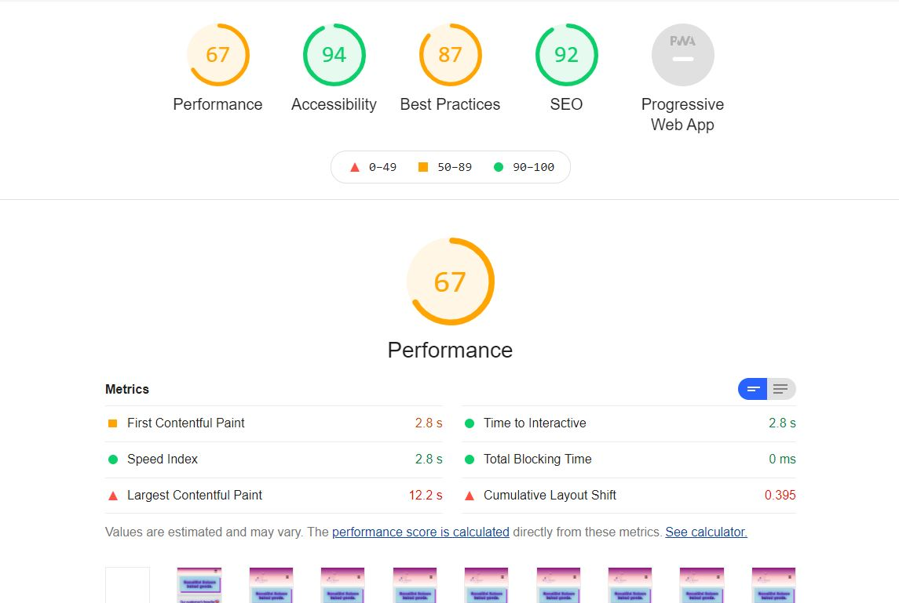

# Tina's Bakery Portofolio website
## User-Centric Frontend Development Milestone Project

 

 
 
 This website is about **Tina's Bakery** a family-owned company that bakes and sells cakes, bread, buns, pastries and other confectionery products. 
 As a user,you can order baking and confectionery products online by filling in the contact information or by making a call.
 This website is a way to help the user to find out what range of bakes the bakery has to offer their customers. 
 Users can also visit Tina's bakery to buy freshly baked products and have a good coffee with freshly brewed coffee. 
___

## Table of Contents
1. UX
    * Site owner business objective
    * User objective
       * New user objective
       * Returning user objective
       * Site owner business objective
    * User stories
    * Structure of the website
    * Wireframes
    * Surface

1. Features
1. Technology
1. Testing
   * Functionality Testing
   * Compatibility Testing
   * Code validation
   * User stories Testing
   * Issues and bugs
   * Perfomance Testing
1. Deployment
1. Credits
1. License
1. Screenshot
1. Contact

# 1. UX
### Site owner business objective
This website is a great opportunity for the owner to be seen online. The customers can place orders at any time.

The website allows the owner to reach the target group and the market.

The user gets the best possible visitor experience. 
### User objective
___
#### New user objective:
 * User can easily find several options about their pastries products. The pastries include images, descriptionS and prices.
 * User can use the contact form to fulfill order.
 * User can design their wishes by adding a file.
 * User can choose a delivery date.
 * User can write an additional request.
 * User can visit and eat at the shop.
 * Customers recommend us to new customers
#### Returning user objective:
 * Users can find new products with the new theme.
 * User can navigate easily on the site.
 * User can get discount.
 * User can come with their wishes.
 * User can write a review.
 
### User stories
___
#### As a site owner:
 * I want to make sure that my customers can easily navigate the website without a problem.
 * I would like my customers to be able to find what are they looking for.
 * I want to give satisfaction to my customers from their additional request and their special order.
 * I want the customers to be able to design or upload their requests.
 * I want to give my customers compensation or discounts if a problem occurred. 
 * I hope that the customers will come back with a new order.
 * I want to deliver the orders on time.
#### As a new customer:
 * I wish that I can find what I am looking for.
 * I wish that it is not complicated to purchase an order.
 * I wish that I can ask for help if I need it.
 * I hope that I can get my order on time.
 * I hope that it is tasty as it looks like. 
 * I hope that it is as perfect and nice as the images.
 * I hope it is not that expensive.
 * I wish the staff and personal are helpful and nice. 
 * I hope that they understand my needs.
#### As a returning customer:
 * I wish that I can find my favorites.
 * I hope they have something new and interesting to offer.
 * I wish I can get a discount.
 ___
### Structure of the website
This is a responsive website which works on all type of devices.
The majority of visitors can quickly find what they want, interactively or creatively way.
The navigation menu is a great tool for the user to navigate the website easily.
___
### Wireframes
I used Balsamiq wireframe for  the skeleton.

[View the wireframe here](https://documentcloud.adobe.com/link/review?uri=urn:aaid:scds:US:e59c686c-b3a7-43a9-ad4d-9adced2a7ffb)
___

### Surface

#### Colors
Colors used on the project: 
 * body:  
     * rgb(230, 231, 231)
 * Menu-bar: 
     * linear-gradient(purple, pink, white)
 * Nav-link:
     * color: hsl(120, 3%, 8%)
     * hover: background-color: #fff
 * h2, h3, h4, h6: 
     * darkorchid
 * h5: #0000ff
 * container and cards: 
     * #ffccff
 * button, button1, button hover 
     * lightblue
     * white
     * #cce6ff
 * tables: 
     * rgb(199, 225, 241)
 * forms: 
     * rgb(237, 222, 241)
* footer, footer p: 
     * aquamarine
     * #990099
* social links: 
     * #ff00ff
#### Fonts
* I used Poppins, Arial and sans-serif.
#### Images
* The images was borrowed from [Canva](http://www.canva.com), [Pixabay](http://www.pixabay.com) and [Besthqwallpapers](http://besthqwallpapers.com).
___
# 2. Features
 The website contains 7 pages. The navigation **Menu** is linked to a pdf file that opens to a separate window.
### Navigation bar
 The navigation is placed on the left upper corner of the page. It is a responsive navigation bar, that works on all devices. 

* The navigation bar contains 7 pages and a logo on the right side: 
     * Home
     * Cakes
     * Bread
     * Gallery
     * Menu
     * About
     * Contact

### Footer
The footer contains the copyright information and social links which connect webpages to a separate tab in a browser. The footer appears on all pages.
#### Home
* The homepage includes two image sections. 
 * 1 image for decoration of the first section.  
 * 4 images represent the bakery's customer's favorite cakes and pastries with descritpions and prices.
#### Cakes
* This page contains 12 images that are divided into different categories: 
 * 4 images for the _wedding cakes_ category
 * 4 images for the _Birthday cakes_ category
 * 4 images for the _Valentine's day cakes_ category
#### Bread
* This page contains images of different kinds of bread with descriptions and prices.
#### Gallery
* This page contains 10 different kinds of pastries and cakes images.
#### Menu
* The menu page contains only a _Menu_ on pdf. 
#### About
* This page contains three sections.
 * The first section describes a lot of information about Tina's bakery.
 * Second section contains _carousel_ with three images.
 * The hird section is about customer reviews.
#### Contact
* This page contains an image, phone number, address, email, and an order form. Users can purchase orders by filling this form.
___
### Future implementations

* Improve the quality of the website by adding a _Cart_ for direct order.
* Possibility to pay with bank cards and credit cards as VISA, Mastercard, and other cards. 
* Details of all ingredients under the product names.
* Add popovers.
* User rating system and experience of our products.
* Add another page where customers can order **present cards**
* Implement newsletter function.
___
# 3. Technology
 #### HTML5
 
 #### CSS
 * CSS used to style the site
 * CSS gradient used to create the background color of the menu-bar.

 #### Bootstrap
 * Bootsrap version 4.2.1. 
 #### Font awesome
 * For the social links icon in the footer section.
 #### Google Fonts
 * As a font resource.
 #### Github
 * As a code hosting platform to store the project, the README file and to add, commit and push. 
 
 #### Gitpod
 * As the main source to create the project.
 #### Git
 * As a version-control system tracking.
 #### Balsamiq
 *  a wireframe to create the desktop and mobile wireframe.
 #### W3 Validator
[w3 Jigsaw](https://jigsaw.w3.org/css-validator/) to validate CSS.

[W3C Validator](https://validator.w3.org/)to check HTML

[Am I Responsive](http://ami.responsivedesign.is/) tool for previewing the site on different devices.
___
# 4. Testing
#### Functionality Testing
 * I used the W3 validator to check and find _error_ and _issues_ on the HTML code and CSS.
   * The result after running the final test on W3 HTML: 
    >Document checking completed. No errors or warnings to show.
   * Result after running the final check on W3 CSS: 
   >Document checking completed. No errors or warning to show.

* Chrome developers used to check the performance of the site.
___
#### Compatibility Testing
[Am I Responsive](http://ami.responsivedesign.is/) used to generate the site images on all devices such as **desktop**, **tablet** , **mobile** and **laptop**

The website was tested with different devices such as Motorola 6, Ihpone 8, Lenovo Thinkpad, MSI Laptop, Lenovo tablet.

The site was run by the following browsers: 
* Google chrome
* Opera
* Firefox
* Microsoft edge
___
#### Issues and bugs by emplenting this site
* Error 304 and 404 on my workspace. I googled what is this for code. After I deleled the browser history everything works fine again.

* After running the [W3 Validator](https://validator.w3.org/) I got the following errors: 

* CSS error: Too many values or values are not recognized.

>I removed the line to fix the problem.

* Poor values of _Alt_ on the images. 
 
>I gave the images the correct value.

* Section lacks heading.

 

  > I added heading elements between the sections.

  ` <h3>Call us: Tel 0523-40 466</h3> ` and ` <h6>Fill the order form below</h6> ` 

___
#### Performance Testing

* After running performance those issues appeared: 

  

  >I soLved the problem by changing the image into _jpg_ and resized the images by using [compressor](https://compressor.io/)

  
  
  >I solved it by adding `<a rel="noreferrer" target="_blank" href="#">` for the social links.

   

  >I resized the DOM size.
 
 

 >I shortened the text from *we accept all orders, large or small, standard or special. We will do our best to satisfy our customers* 
  to  *Fill the form below*

 

 > I added width and height on the images above

  Final result of performance: 

  

  
___ 
#### User storie testing
##### As a site owner:
* I want to make sure that my customers can easily navigate the website without a problem.
> Customers can use the navigation bar to search through the site.
* I would like my customers to be able to find what are they looking for.
> Multiple choices of images will help customers through their purchasing.
* I want to give satisfaction to my customers from their additional request and their special order.
> Customers can find information about the _additiomal request_ on the contact page. Customers can easily fill in the request field.
* I want the customers to be able to design or upload their requests.
> The possibility to send and upload a customer's file or picture can easily be done by filling in the order form.
* I hope that the customers will come back with a new order.
> Customers can make new orders by surfing on the home page, cakes page, and bread page.
* I want to deliver the orders on time.
> By choosing a date on the calendar on the contact form, customers can get their orders on time.
##### As a new customer:
* I wish that I can find what I am looking for.
> More information can new customers find on all pages.
* I wish that it is not complicated to purchase an order.
 * I wish that I can ask for help if I need it.
> Use the contact information by making a call, sending an email, fill the form, or coming for visit to the shop.
* I hope that I can get my order on time.
> Customers can select the date of delivery.
* I hope that it is tasty as it looks like.
 * I hope that it is as perfect and nice as the images.
> Customers can have a look at the images.
* I hope it is not that expensive.
> All the products are marked with prices.
* I wish the staff and personal are helpful and nice.
> Customers can use the contact information.
* I hope that they understand my needs.
> The additional request is for that. Customers can explain and write in detail their wishes.
##### As a returning customer:
* I wish that I can find my favorites.
> Customers can scroll through the images.
* I hope they have something new and interesting to offer.
> New theme for a different season.
* I wish I can get a discount.
> Customers get a discount after the third order.
___
#### Code validation

[w3 Jigsaw](https://jigsaw.w3.org/css-validator/) to validate CSS.

[W3C Validator](https://validator.w3.org/)to check HTML
___
# 5. Deployment
To deploy the Github pages, I used the following steps: 
  * Before creating the repository, I used [Code institute student full templalte link](https://github.com/Code-Institute-Org/gitpod-full-template).
  * Click on **use this template** and create my repository. 
  * [Repository name](https://github.com/Sojasmine/my-MLS1-Tina-s-Bakery)
  * From the settings, under the GithHub Pages, I choose **master** branch and clicked on the Save button.
  * My github page is published at [site name](https://sojasmine.github.io/my-MLS1-Tina-s-Bakery/)
  * Back on the top of my repository pages, besides the green _gitpod_ button. I wrote a short description of my project linked in with my github page. I added Tina's Bakery as **topics**.

Forking is making a copy of the repository:

 Steps to fork the GitHub Repository
  * Log in into your Github account.
  * Find the Github repository with you'd like to fork.
  * Go to the top of the repository page [here](https://github.com/Sojasmine/my-MLS1-Tina-s-Bakery).
  * Click the Fork button on the upper right-hand side under your profile photo.
  * Now, you have a copy of the repository on your Github account.
Clone a repository:
  * You have to determine the URL for the forked repository before you can _clone it_ 
  * Copy the URL and then use it with *git clone*
  * Remember that it is the copy you have to clone not the original repository.
___
# 6. Credits

* These websites were a great help for me during this project: 

  * [W3 schools](https://www.w3schools.com)

  * [Google search](https://www.google.com)

  * [Pixabay](http://www.pixabay.com)

  * [Canva](http://www.canva.com)

  * [Besthqwallpapers](http://besthqwallpapers.com)

  * [Free logo design](http://www.freelogodesign.org)

  * [stackoverflow](https://stackoverflow.com/)

  * [Google chrome](https://chrome.google.com/)
  
___
#### Code
* Bootstrap: [Hamburger menu](https://getbootstrap.com/docs/4.2/components/navbar/)
* W3s chools: [Color of the navigation menu](https://www.w3schools.com/cssref/func_linear-gradient.asp)
* Bootstrap: [Cards](https://getbootstrap.com/docs/4.2/components/card/)
* W3 schools: [Jumbotron](https://www.w3schools.com/bootstrap/tryit.asp?filename=trybs_jumbotron&stacked=h)
* Bootstrap: [Forms](https://getbootstrap.com/docs/4.2/components/forms/)
* W3 schools: [emoJI](https://www.w3schools.com/charsets/ref_emoji.asp)
* W3 schools: [Symbols](https://www.w3schools.com/html/html_symbols.asp)
* Bootstrap: [Carousel](https://getbootstrap.com/docs/4.2/components/carousel/)
___
#### Images

The images were obtained from: 

[Free logo design](http://www.freelogodesign.org) used to create the logo.

[canva](http://www.canva.com)

[Besthq wallpapers](http://besthqwallpapers.com)

[pixabay](http://www.pixabay.com)

* Logo for the **Navbar**. The logo is applied to all pages.

   * [The logo](https://editor.freelogodesign.org/?lang=en&logo=3613cf6a-7633-4fee-8871-8837207f6954)

* **Home** images: 

   * [link to the image](https://besthqwallpapers.com/sv/semester/alla-hj%C3%A4rtans-dag-14-februari-cupcake-t%C3%A5rta-med-lila-gr%C3%A4dde-hj%C3%A4rtat-40269)

   * [birthday deluxe](https://besthqwallpapers.com/sv/semester/grattis-p%C3%A5-f%C3%B6delsedagen-t%C3%A5rta-med-ljus-t%C3%A5rta-ljus-17303)

   * [cheese cake deluxe](https://besthqwallpapers.com/sv/mat/choklad-kaka-b%C3%A4r-choklad-bl%C3%A5b%C3%A4r-choklad-cheesecake-49979)

   * [fruit deluxe](https://besthqwallpapers.com/sv/mat/grattis-p%C3%A5-f%C3%B6delsedagen-t%C3%A5rta-s%C3%B6tsaker-bakverk-frukt-t%C3%A5rta-30157)

   * [wedding deluxe](https://besthqwallpapers.com/sv/mat/br%C3%B6llopst%C3%A5rta-vit-kr%C3%A4m-vit-multi-niv%C3%A5-t%C3%A5rta-med-rosor-efterr%C3%A4tt-kakor-59142)

* **Cakes** images: 
  
    * [wedding cake deluxe nr1](https://besthqwallpapers.com/sv/mat/br%C3%B6llopst%C3%A5rta-tr%C3%A4kakastativ-tv%C3%A5delad-t%C3%A5rta-br%C3%B6llop-t%C3%A5rta-153045)

    * [wedding cake deluxe nr2](https://besthqwallpapers.com/sv/mat/br%C3%B6llopst%C3%A5rta-r%C3%B6da-rosor-en-stor-kaka-godis-br%C3%B6llop-koncept-40436)

    * [wedding cake deluxe nr3](https://besthqwallpapers.com/sv/semester/br%C3%B6llopst%C3%A5rta-br%C3%B6llop-en-stor-kaka-vit-t%C3%A5rta-9174)

    * [wedding cake deluxe nr4](https://besthqwallpapers.com/sv/mat/br%C3%B6llopst%C3%A5rta-bakverk-t%C3%A5rta-med-rosor-mat-dekorationer-kakor-47489 )
    
    * [birthday cake deluxe nr 1](https://besthqwallpapers.com/sv/download/35563/800x600)

    * [birthday cake deluxe nr 2](https://besthqwallpapers.com/sv/semester/grattis-p%C3%A5-f%C3%B6delsedagen-bl%C3%A5-t%C3%A5rta-ljus-jordgubbar-f%C3%B6delsedag-18365)

    * [birthday cake deluxe nr 3](https://besthqwallpapers.com/sv/semester/grattis-p%C3%A5-f%C3%B6delsedagen-holiday-t%C3%A5rta-s%C3%B6tsaker-bl%C3%A5-t%C3%A5rta-45918)

    * [birthday cake deluxe nr 4](https://besthqwallpapers.com/sv/semester/grattis-p%C3%A5-f%C3%B6delsedagen-rosa-t%C3%A5rta-f%C3%B6delsedag-begrepp-ljus-f%C3%B6delsedag-28536)

    * [valentine's cake deluxe nr 1](https://besthqwallpapers.com/sv/mat/hj%C3%A4rta-kaka-efterr%C3%A4tt-t%C3%A5rta-t%C3%A5rta-med-jordgubbar-23)

    * [valentine's cake deluxe nr 2](https://besthqwallpapers.com/sv/mat/rosa-t%C3%A5rta-f%C3%B6delsedag-r%C3%B6da-rosor-fr%C3%A5n-cream-socker-rosor-bakverk-47061)

    * [valentine's cake deluxe nr 3](https://besthqwallpapers.com/sv/mat/hallon-paj-s%C3%B6ta-bakverk-makro-hallon-hj%C3%A4rta-formade-paj-134503)

    *  [valentine's cake deluxe nr 4](https://besthqwallpapers.com/sv/mat/alla-hj%C3%A4rtans-dag-t%C3%A5rta-s%C3%B6tsaker-t%C3%A5rta-dekoration-romantisk-present-39264)

* **Bread** images:

    * [rye bread](https://pixabay.com/sv/photos/br%C3%B6d-limpor-bageri-br%C3%B6dskivor-388647)

    * [rolls with chocolate](https://pixabay.com/sv/photos/br%C3%B6d-bageri-1657979)
 
    * [loaf](https://pixabay.com/sv/photos/mat-friska-br%C3%B6d-f%C3%A4rska-bageri-2755315)

    * [sport bread](https://pixabay.com/sv/photos/br%C3%B6d-hembakat-br%C3%B6d-bageri-frukost-2462782)

    * [coarse loaf](https://pixabay.com/sv/photos/br%C3%B6d-bagare-bakade-varor-hantverk-1954797)

    * [rolls with seeds](https://pixabay.com/sv/photos/mat-f%C3%B6rfriskning-l%C3%A4ckra-3256555)

    * [mini baguette](https://pixabay.com/sv/photos/br%C3%B6d-choklad-s%C3%B6t-mat-bageri-kaka-3658575)

    * [gluten free rolls](https://pixabay.com/sv/photos/rullar-bageri-frukost-%C3%A4ta-k%C3%B6k-2018744)

* **Gallery** Images:

    * [cake 21](https://besthqwallpapers.com/sv/semester/glad-alla-hj%C3%A4rtans-dag-14-februari-choklad-kakor-r%C3%B6da-hj%C3%A4rtan-romantisk-kv%C3%A4ll-37276)

    * [cake 19](https://besthqwallpapers.com/sv/semester/grattis-p%C3%A5-f%C3%B6delsedagen-holiday-cupcakes-gratulationskort-muffins-med-ljus-t%C3%A5rta-98201)

    * [cake 20](https://besthqwallpapers.com/sv/semester/halloween-cupcakes-orange-cream-s%C3%B6tsaker-bakverk-cupcakes-106282)

    * [cake 16](https://besthqwallpapers.com/sv/mat/pannkakor-med-b%C3%A4r-4k-bl%C3%A5b%C3%A4r-jordgubbar-mynta-137326)

    * [cake 15](https://besthqwallpapers.com/sv/drycker/vinb%C3%A4r-smoothies-4k-b%C3%A4r-frukt-frukost-101069)

    * [cake 10](https://besthqwallpapers.com/sv/mat/f%C3%B6delsedag-rosa-t%C3%A5rta-s%C3%B6tsaker-kakor-cupcakes-32705)

    * [cake 11](https://besthqwallpapers.com/sv/mat/frukost-rostat-br%C3%B6d-br%C3%B6d-frukt-jordgubbar-14068)

    * [cake 23](https://besthqwallpapers.com/sv/mat/br%C3%B6llopst%C3%A5rta-lila-stor-kaka-br%C3%B6llop-koncept-kakor-77764)

    * [cake 12](https://besthqwallpapers.com/sv/mat/f%C3%B6delsedag-rosa-t%C3%A5rta-s%C3%B6tsaker-jordgubbst%C3%A5rta-rosa-gr%C3%A4dde-43483)

    * [cake 24](https://besthqwallpapers.com/sv/mat/br%C3%B6llop-rosa-t%C3%A5rta-rosa-gr%C3%A4dde-rosor-dekoration-br%C3%B6llop-koncept-kakor-79216)

* **Menu** pdf:

    *  Link to the [Menu](https://www.canva.com/design/DAEVK9Qynis/lEs6er7acvvIIMO3tktnAA/edit)

* **About** images: 

    * [bagery](https://pixabay.com/sv/photos/marbella-andalusien-spanien-bageri-1437172/)

    * [cake26](https://pixabay.com/sv/photos/t%C3%A5rta-vispad-gr%C3%A4dde-konditori-204885/)

    * [bakery](https://pixabay.com/sv/photos/bageri-br%C3%B6d-ugn-hantverkare-br%C3%B6d-737476/)

* **Contact** images:

    * [cake 17](https://besthqwallpapers.com/sv/mat/korn-kaffe-frukost-v%C3%A4xande-608)
    ___
# Acknowledgement: 
    
   * After speaking with my mentor about my idea, he suggests that I can use [Nuts about cake](http://www.nutsaboutcakes.com) as a source of inspiration. 
   Thanks to him, I managed to fulfill this project.
___
# 7. License
   * No license needed. All the images are free.
___
# 8. Screenshot
* Home

* Cakes

* Bread

* Gallery

* About

* Menu
 
* Contact

___
# 9. Contact

   * Author: Sojasmine Gjerstad. Student at Code Intsitute,2021.

     Project link: [My github pages](https://sojasmine.github.io/my-MLS1-Tina-s-Bakery/)

     
 
   

   

    

   

    
        
  
    
        

 